<p align="center">
  
</p>

<p align="center">
  
</p>

<p align="center">
  <a href="mailto:ashwinr2007@gmail.com"></a>
  <a href="https://github.com/ash-labs-02"></a>
  <a href="https://13-62-80-223.sslip.io/#dc-glover-park"></a>
</p>

## About Me

I'm **Ashwin Raghavendran**, a Computer Science and Engineering (IoT) undergraduate at **Sri Krishna College of Technology, Coimbatore**, graduating in **2028**.

I build software that connects data, machine learning and real-world systems: terrain reconstruction from satellite imagery, market-data analysis and autonomous robotics. I'm interested in **financial technology and quantitative problem-solving**, and in making complex systems useful through clear APIs and interactive applications.

- **Computer vision:** single-image terrain reconstruction with PyTorch and Depth Anything V2.
- **Backend development:** FastAPI and Flask applications, REST APIs and modular data pipelines.
- **Finance:** market-data processing, sentiment analysis and LLM-assisted insights.
- **Hardware:** ESP32-based robotics, sensor integration and firmware development.
- **Recognition:** semifinalist at the Atomquest'25 national hackathon with VacX.

```python
ashwin = {
    "languages": ["Python", "C++", "JavaScript"],
    "backend": ["FastAPI", "Flask", "REST APIs"],
    "machine_learning": ["PyTorch", "Depth Anything V2", "OpenAI API"],
    "deployment": ["Docker", "AWS EC2"],
    "interests": ["Financial technology", "Computer vision", "Robotics"],
    "education": "B.E. Computer Science and Engineering (IoT), expected 2028",
}
```

## Tech Stack

<p align="center">
  
</p>

<details open>
<summary><strong>Machine Learning & Geospatial Data</strong></summary>

PyTorch · Depth Anything V2 · OpenAI API · GPT-4 · Gemini Nano · TextBlob · Rasterio · GDAL · Copernicus GLO-30

</details>

<details>
<summary><strong>Backend & Financial Data</strong></summary>

FastAPI · Flask · REST APIs · Pathway · yFinance · CSV/JSON data ingestion

</details>

<details>
<summary><strong>Frontend, Cloud & Tooling</strong></summary>

JavaScript · React · Three.js · Chrome Extensions (Manifest V3) · Docker · AWS EC2 · Git

</details>

<details>
<summary><strong>Embedded Systems & Robotics</strong></summary>

C++ · ESP32-CAM · Ultrasonic and IR sensors · Firmware development · 3D-printed PLA chassis

</details>

## Featured Projects

<table>
<tr>
<td width="50%" valign="top">

### DepthWizard
**Single-Image 3D Terrain Intelligence**

`PyTorch` `FastAPI` `Three.js` `Rasterio/GDAL` `Docker` `AWS`

Reconstructs terrain and building heights from a single optical image, with georeferenced outputs and an interactive 3D interface.

- Fine-tuned Depth Anything V2 on **9,000+** aerial and satellite LiDAR tiles.
- Achieved **1.66 m error** on held-out WorldView tiles.
- Automated Copernicus GLO-30 calibration and GIS-ready exports.
- Deployed on AWS EC2 with flythrough, flood, landslide and change-detection tools.

[Explore the live demo](https://13-62-80-223.sslip.io/#dc-glover-park)

</td>
<td width="50%" valign="top">

### RealTime-Finance
**Market Data & Trading Insights**

`Python` `Flask` `Pathway` `yFinance` `TextBlob` `Docker`

A modular backend for stock tracking, market-data processing and sentiment analysis.

- Integrated market data and sentiment analysis into reusable pipelines.
- Generated trading insights with GPT-based models.
- Exposed results through REST APIs for frontend integration.

</td>
</tr>
<tr>
<td width="50%" valign="top">

### VacX
**Autonomous Vacuum & Mopping Robot**

`C++` `ESP32-CAM` `Sensors` `Firmware` `3D Printing`

A working vacuum-and-mop prototype with obstacle detection, centrifugal suction, dual brushes and Wi-Fi control.

- Built the hardware, PLA chassis and firmware.
- Supported autonomous and manual operation.
- **Atomquest'25 national hackathon semifinalist.**

</td>
<td width="50%" valign="top">

### PolicyAI
**Natural-Language Policy Analysis**

`Python` `GPT-4` `OpenAI API` `CSV/JSON`

A query engine that turns policy datasets into natural-language summaries and recommendations.

- Designed dataset ingestion and custom prompts.
- Implemented automated insight generation.
- Delivered a modular command-line interface.

</td>
</tr>
</table>

## Education & Recognition

**B.E. Computer Science and Engineering (IoT)**  
Sri Krishna College of Technology, Coimbatore · Expected 2028

**Atomquest'25 National Hackathon - Semifinalist**  
Atomberg Technologies · 2025 · VacX recognized for innovation and full hardware implementation.

---

<p align="center">
  <strong>Let's connect</strong><br />
  <a href="mailto:ashwinr2007@gmail.com">ashwinr2007@gmail.com</a>
</p>
